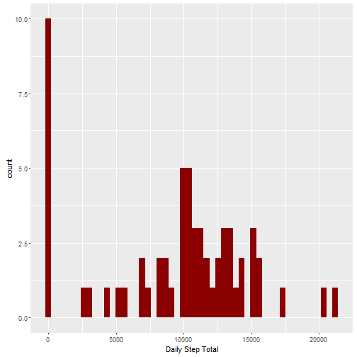
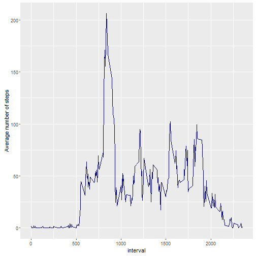
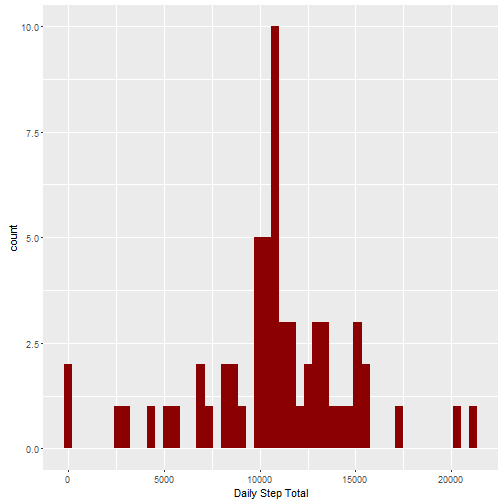
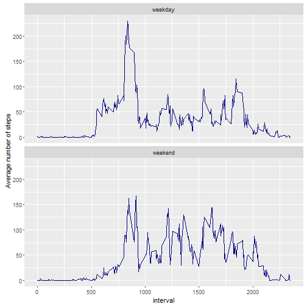

Reproducible Research Project 1
============================================

##Part 1: Loading and processing the data  
The data set contains 2 months (Oct-Nov 2012) of recorded steps each day, broken down into 5 minute intervals. This section completes the following:

- Loads the necessary R packages
- Reads in the data
- Formats the date column as class "date"
- Print out the first few lines of data  
  
####The below coded loads the R packages. 

```r
library(dplyr)
library(tidyr)
library(ggplot2)
```

####The below code reads and processes the data, as well as prints the first few lines.  
Note, missing values are kept in the data.  
  

```r
data <- read.csv("activity.csv", na.strings = "NA")
data$date <- as.Date(data$date,"%Y-%m-%d")
data_df <- tbl_df(data) %>%
        select(date, interval, steps)
data_df
```

```
## # A tibble: 17,568 x 3
##          date interval steps
##        <date>    <int> <int>
## 1  2012-10-01        0    NA
## 2  2012-10-01        5    NA
## 3  2012-10-01       10    NA
## 4  2012-10-01       15    NA
## 5  2012-10-01       20    NA
## 6  2012-10-01       25    NA
## 7  2012-10-01       30    NA
## 8  2012-10-01       35    NA
## 9  2012-10-01       40    NA
## 10 2012-10-01       45    NA
## # ... with 17,558 more rows
```

## Part 2: What is mean total number of steps taken per day?
This section completes the following:

- Groups the data by day
- Plots a histogram of daily total steps
- Calculates and reports the mean and median number of steps per day  


####The  below code groups and summarizes the total steps by day, and plots a histogram of total daily steps.

```r
day_totals <- data_df %>%
        group_by(date) %>%
        summarize(total_steps = sum(steps, na.rm = TRUE))

g <- ggplot(day_totals, aes(total_steps))
g + geom_histogram(bins = 50, fill = "dark red") + labs(x = "Daily Step Total")
```




####The below code prints the mean and median total steps per day. 

```r
mean_daytotal <- mean(day_totals$total_steps)
median_daytotal <- median(day_totals$total_steps)
paste("The mean total steps per day is ", round(mean_daytotal,0),", and the median total steps per day is ", round(median_daytotal,0),".", sep = "")
```

```
## [1] "The mean total steps per day is 9354, and the median total steps per day is 10395."
```

## Part 3: What is the average daily pattern?
This section completes the following (see code below):

- Produces a time series plot of the average steps by time interval
- Reports the time interval that has the highest step count on average


```r
interval_avg <- data_df %>%
        group_by(interval) %>%
        summarize(avg_steps = mean(steps, na.rm = TRUE))

g <- ggplot(interval_avg, aes(interval,avg_steps))
g + geom_line(color = "navy") + labs(y = "Average number of steps")
```



## Part 4: Imputing Missing Values
The section completes the following:

- Reports the number of missing values in the dataset
- Fills in missing values with an expected amount based on interval averages.
- Plots new histogram based on the revised data with missing values filled in  


####The below code determines the number of missing values in the data.

```r
paste("The number of missing values is ", sum(is.na(data_df[,3])),".", sep = "")
```

```
## [1] "The number of missing values is 2304."
```


####The below code imputes missing values (based on interval averages), and plots a new hostogram of daily step totals.

```r
interval_means <- data_df %>%
        group_by(interval) %>%
        summarize(Avg_steps = mean(steps, na.rm = TRUE))

data_fill <- merge(data_df,interval_means, by = "interval") %>%
        arrange(date, interval) %>%
        mutate(steps_fill = ifelse(is.na(steps),Avg_steps,steps)) %>%
        select(date, interval, steps_fill) %>%
        tbl_df()

day_totals <- data_fill %>%
        group_by(date) %>%
        summarize(total_steps = sum(steps_fill, na.rm = TRUE))

library(ggplot2)
g <- ggplot(day_totals, aes(total_steps))
g + geom_histogram(bins = 50, fill = "dark red") + labs(x = "Daily Step Total")
```



####The below code prints the mean and median total steps per day, for the "imputed" dataset. 

```r
mean_daytotal <- mean(day_totals$total_steps)
median_daytotal <- median(day_totals$total_steps)
paste("The mean total steps per day is now ", round(mean_daytotal,0),", and the median total steps per day is now ", round(median_daytotal,0),".", sep = "")
```

```
## [1] "The mean total steps per day is now 10766, and the median total steps per day is now 10766."
```

## Part 5: Activity patterns between weekdays and weekends
This section completes the following (see code below):

- Adds a weekday/weekend indicator to the modified "imputed" dataset
- Produces a time series panel plot of the average steps by time interval, for weekdays vs weekends
- Reports the time interval that has the highest step count on average


```r
interval_avg <- data_fill %>%
        mutate(weekend = ifelse((weekdays(date) == "Saturday")|(weekdays(date) == "Sunday"),"weekend","weekday")) %>%
        group_by(weekend, interval) %>%
        summarize(avg_steps = mean(steps_fill))

g <- ggplot(interval_avg, aes(interval,avg_steps))
g + geom_line(color = "navy") + facet_wrap(~weekend,ncol = 1) + labs(y = "Average number of steps")
```




####The below code determines the intervals with highest average step count for weekdays vs weekends. 

```r
highest <- data_fill %>%
        mutate(weekend = ifelse((weekdays(date) == "Saturday")|(weekdays(date) == "Sunday"),"weekend","weekday")) %>%
        group_by(weekend, interval) %>%
        summarize(avg_steps = mean(steps_fill)) %>%
        group_by(weekend) %>%
        summarize(highest = max(avg_steps))

interval_avg[interval_avg$avg_steps %in% highest$highest,]
```

```
## Source: local data frame [2 x 3]
## Groups: weekend [2]
## 
##   weekend interval avg_steps
##     <chr>    <int>     <dbl>
## 1 weekday      835  230.3782
## 2 weekend      915  166.6392
```
